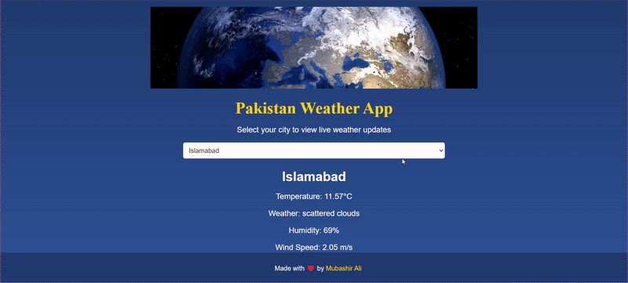

# Pakistan Weather App

A simple and intuitive weather application that provides live weather updates for various cities in Pakistan. Users can select a city from a dropdown menu and view the current weather conditions.

## Demo

 

## Project Link
Checkout my project here [Link](https://pk-weather.vercel.app/)


## Features


- **City Selection**: Choose from a list of cities, including Islamabad, Lahore, Karachi, Gilgit, and Abbottabad.
- **Live Weather Updates**: Fetch real-time weather data based on the selected city's geographic coordinates (latitude and longitude).
- **User-Friendly Interface**: Enjoy a clean and modern design with a prominent hero section and an easy-to-use dropdown menu for city selection.
- **Responsive Design**: Optimized for both mobile and desktop devices to provide a seamless user experience across different screen sizes.


## Getting Started

To set up and run this project locally, follow these steps:

### Prerequisites

- A modern web browser (Chrome, Firefox, Safari, etc.).
- No additional software is needed, as this is a simple static web page.

### Installation

1. Clone the repository:

   ```bash
   git clone https://github.com/mubashir1837/Coursera-Weather-App-Project.git


Mubashir Ali - Founder @ Code with Bismillah | Aspiring Bioinformatics & Data Science Professional | Bridging Biology & Data | Researcher | Genomics, Machine Learning, AI | Python, R, Bioinformatics Tools
